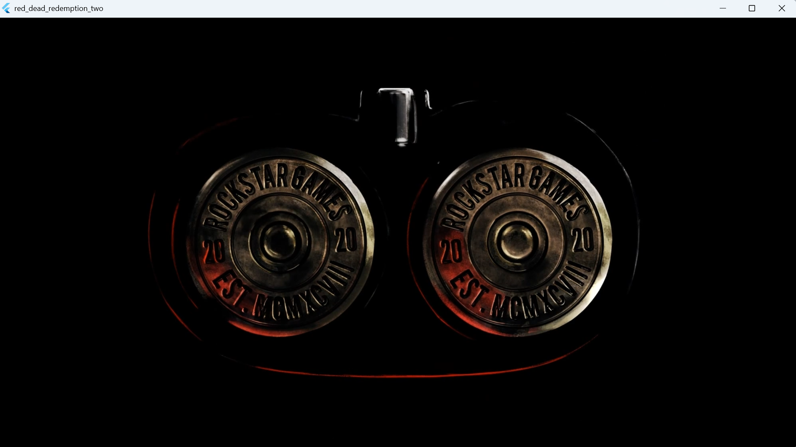
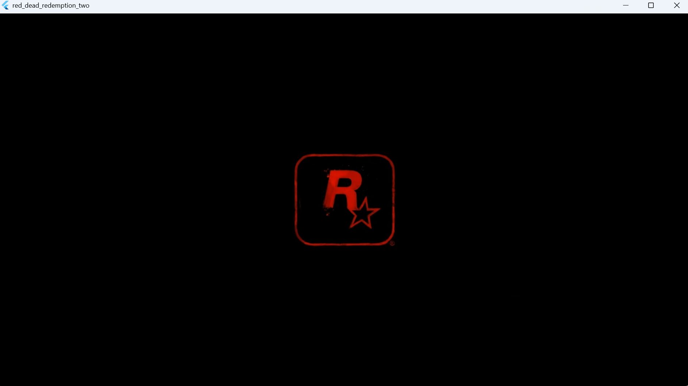
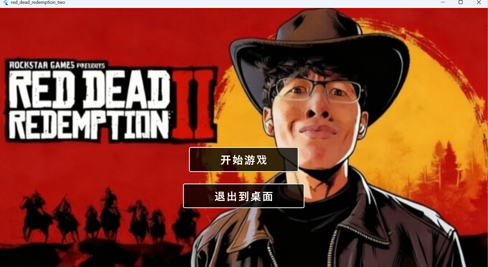

# Red Dead Redemption 2 - 唐嘉祺主题版

一个基于 Flutter 开发的荒野大镖客 2 主题 Windows 桌面应用程序。

## 项目简介

本项目是一次课堂作业，以荒野大镖客 2 为主题进行开发，同时融入了对博主"唐嘉祺"的趣味元素。项目包含启动动画、主界面和视频播放功能，所有视频完全内嵌在应用窗口中播放，提供良好的用户体验。

虽说是趣味项目，但代码质量和功能完整性都得到了保证，适合作为 Flutter 桌面应用开发的学习参考。

## 应用截图

### 启动动画



### 主界面


## 功能特性

### 🎬 启动动画
- 自动播放荒野大镖客 2 主题启动视频
- 视频完全内嵌在应用窗口中
- 使用 WebView + HTML5 视频播放器，兼容性最佳
- 视频播放完成后自动进入主界面
- 完善的错误处理，即使视频无法播放也能正常进入主界面

### 🎮 主界面
- 荒野大镖客 2 主题背景
- 动态闪烁效果，增强视觉体验
- 简洁直观的用户界面
- 两个主要功能按钮

### 📹 视频播放
- 开场动画自动播放（head.mp4）
- 点击"开始游戏"播放游戏视频（play.mp4）
- 所有视频完全内嵌在窗口中
- 游戏视频带有完整控制栏（暂停、播放、进度条）
- 随时点击"关闭"按钮返回主界面

### ⚡ 性能优化
- 基于 Flutter 框架，跨平台兼容
- 使用 WebView + HTML5 视频播放器，兼容性最佳
- 本地 HTTP 服务器提供资源，消除跨域问题
- 响应式设计，适配不同屏幕尺寸

## 系统要求

### 最低配置
- **操作系统**: Windows 10 或更高版本
- **处理器**: Intel Core i3 或同等性能处理器
- **内存**: 4 GB RAM
- **显卡**: 支持 DirectX 11 的显卡
- **存储空间**: 500 MB 可用空间
- **网络**: 首次运行时可能需要下载 WebView 运行时

### 推荐配置
- **操作系统**: Windows 10/11（64位）
- **处理器**: Intel Core i5 或更高
- **内存**: 8 GB RAM 或更多
- **显卡**: NVIDIA GTX 1050 或 AMD 同等性能显卡
- **存储空间**: 1 GB 可用空间

## 安装说明

### 方式一：直接运行可执行文件（推荐）

1. 下载 Release 版本的压缩包
2. 解压到任意目录
3. 双击运行 `red_dead_redemption_two.exe`
4. 开始享受应用！

### 方式二：从源码构建

#### 前置要求
- Flutter SDK 3.11.1 或更高版本
- Visual Studio 2022（包含 "Desktop development with C++" 工作负载）
- Windows 10 SDK 或更高版本

#### 构建步骤

1. **克隆或下载项目**
   ```bash
   cd red_dead_redemption_two
   ```

2. **安装依赖**
   ```bash
   flutter pub get
   ```

3. **构建 Debug 版本**
   ```bash
   flutter build windows --debug
   ```

4. **构建 Release 版本（推荐）**
   ```bash
   flutter build windows --release
   ```

5. **运行应用**
   - Debug 版本: `build\windows\x64\runner\Debug\red_dead_redemption_two.exe`
   - Release 版本: `build\windows\x64\runner\Release\red_dead_redemption_two.exe`

## 使用方法

### 基本操作

1. **启动应用**
   - 双击 `red_dead_redemption_two.exe` 启动应用
   - 应用会自动播放开场动画（内嵌在窗口中）
   - 动画播放完成后自动进入主界面

2. **主界面操作**
   - **开始游戏**: 点击播放游戏视频（内嵌在窗口中）
   - **退出到桌面**: 点击关闭应用程序

3. **视频播放**
   - 开场动画自动播放，无需操作
   - 游戏视频带有完整控制栏
   - 点击右上角的关闭按钮可随时返回主界面

### 快捷键

目前版本暂不支持键盘快捷键，所有操作通过鼠标点击完成。

## 技术栈

### 核心框架
- **Flutter**: 3.11.1
- **Dart**: 3.11.1

### 主要依赖
- **webview_windows**: ^0.4.0 - Windows 平台 WebView 组件
- **shelf**: ^1.4.1 - 本地 HTTP 服务器
- **shelf_static**: ^1.1.2 - 静态文件服务
- **path_provider**: ^2.1.5 - 路径管理
- **cupertino_icons**: ^1.0.8 - iOS 风格图标

### 视频播放方案
- **WebView + HTML5 Video**: 完美的内嵌视频播放
- **本地 HTTP 服务器**: 解决跨域问题
- **相对路径引用**: 确保视频文件能正常访问

### 开发工具
- **Visual Studio 2022**
- **Flutter SDK**
- **Git** (可选)

## 项目结构

```
red_dead_redemption_two/
├── lib/
│   └── main.dart              # 主应用入口文件
├── assets/
│   ├── images/                # 图片资源
│   │   ├── main_background.jpg
│   │   └── flash_background.jpg
│   └── videos/                # 视频资源
│       ├── head.mp4           # 开场动画
│       ├── play.mp4           # 游戏视频
│       ├── intro.mp4
│       └── main_video.mp4
├── build/
│   └── windows/
│       └── x64/
│           └── runner/
│               ├── Debug/     # Debug 版本
│               └── Release/   # Release 版本
├── pubspec.yaml               # 项目配置文件
└── README.md                  # 项目说明文档
```

## 技术亮点

### 视频内嵌播放方案
1. **本地 HTTP 服务器**: 使用 shelf 创建本地服务器提供视频文件
2. **WebView 组件**: 使用 webview_windows 在 Flutter 中嵌入浏览器
3. **HTML5 Video**: 使用标准的 HTML5 video 标签播放视频
4. **相对路径**: 视频文件与 HTML 页面在同一目录，避免跨域问题
5. **完整控制**: 游戏视频提供完整的播放控制功能

### 稳定性保障
- **完善的 try-catch**: 所有关键操作都有错误处理
- **优雅降级**: 即使视频无法播放，应用也能正常运行
- **超时保护**: 开场动画 15 秒后自动进入主界面
- **资源清理**: 正确释放 HTTP 服务器和 WebView 资源

## 已知问题

### WebView 运行时
- 首次运行时可能需要下载 Microsoft Edge WebView2 运行时
- Windows 11 通常已预装，Windows 10 可能需要手动安装

### 视频格式
- 推荐使用 MP4 (H.264) 格式，兼容性最佳
- 其他格式可能需要额外的解码器

## 故障排除

### 应用无法启动
1. 确认系统满足最低配置要求
2. 检查是否已安装 Microsoft Edge WebView2 运行时
3. 尝试以管理员身份运行
4. 检查 Windows 事件查看器中的错误日志

### 视频无法播放
1. 确认视频文件存在且未损坏
2. 检查视频格式是否为 MP4 (H.264)
3. 尝试使用其他视频播放器测试视频文件
4. 确认系统有足够的磁盘空间（临时文件需要空间）

### WebView 相关问题
1. 下载并安装最新的 Microsoft Edge WebView2 运行时
   - 下载地址: https://developer.microsoft.com/en-us/microsoft-edge/webview2/
2. 确保 Windows 更新到最新版本
3. 重启应用后重试

### 构建失败
1. 确保已正确安装 Flutter SDK
2. 运行 `flutter doctor` 检查环境
3. 确保 Visual Studio 包含 "Desktop development with C++" 工作负载
4. 清理构建缓存：
   ```bash
   flutter clean
   flutter pub get
   ```

## 开发说明

### 添加新视频
1. 将视频文件放入 `assets/videos/` 目录
2. 更新 `pubspec.yaml` 中的 assets 配置（如需要）
3. 修改 `main.dart` 中的视频路径引用和 HTML 模板

### 修改界面
- 主界面背景: `assets/images/main_background.jpg`
- 闪烁背景: `assets/images/flash_background.jpg`
- 界面布局: `lib/main.dart` 中的 `MainScreen` 组件

### 自定义配置
编辑 `lib/main.dart` 文件可以自定义：
- 闪烁间隔时间
- 按钮样式和文字
- 视频播放行为
- HTML 模板内容（修改 video 标签属性）

## 性能优化建议

1. **使用 Release 版本**: Release 版本性能更好，体积更小
2. **使用 SSD**: 将应用安装在 SSD 上可以提升加载速度
3. **关闭后台程序**: 释放更多系统资源给应用使用
4. **保持系统更新**: 最新的 Windows 和 WebView2 运行时通常有更好的性能

## 未来计划

- [ ] 添加音量控制功能
- [ ] 支持播放列表功能
- [ ] 添加更多主题选项
- [ ] 支持键盘快捷键
- [ ] 添加设置界面
- [ ] 支持更多视频格式
- [ ] 添加循环播放选项

## 许可证

本项目仅供学习和个人使用。

荒野大镖客 2（Red Dead Redemption 2）是 Rockstar Games 的注册商标。
所有游戏相关素材版权归 Rockstar Games 所有。

## 贡献

欢迎提交 Issue 和 Pull Request！

## 联系方式

如有问题或建议，请通过以下方式联系：
- 提交 GitHub Issue
- 发送邮件

## 致谢

- 感谢 Flutter 团队提供优秀的跨平台框架
- 感谢 webview_windows 开发者提供 Windows 平台 WebView 组件
- 感谢 shelf 团队提供简洁的 HTTP 服务器库
- 感谢 Rockstar Games 创造的精彩游戏

---

**享受荒野大镖客 2 的世界！** 🤠
